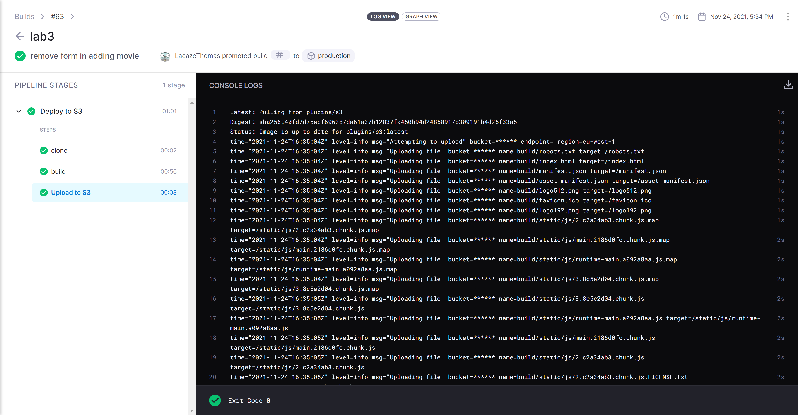

*This document is generated automatically at each commit thanks to Drone CI*

See here for more information about CI : **[https://drone.io/](https://drone.io/)**

All code source is available on **[Github](https://github.com/Cloud-Integration-2021)**, each repository has its own readme and installation steps.


# Lab1 - Java API Rest
*Using Spring boot, Hibernate and JPA with PostgreSQL, Swagger*

CRUD operations on movies. With CircuitBreaker, Retry and Timeout. 

There are two version of this API:

## V1

Using CircuitBreaker, Retry, TimeLimiter with annotations. All endpoints disposes of a circuit breaker, retry and only *getAll* and *getById* has TimeLimiter.

So in fact, Spring root all traffic to service B. If service B is down, the circuit breaker will open. And request will be sent to himself.

```java
@RequestMapping("/api/v1/movies")
public class MovieController {
...

	@GetMapping("")
    @ApiOperation(value = "List all")
    @CircuitBreaker(name = "MovieService", fallbackMethod = "getAllFallback")
    @Retry(name = "MovieService", fallbackMethod = "getAllFallback")
    @TimeLimiter(name = "MovieService", fallbackMethod = "getAllFallback")
    public CompletableFuture<ResponseEntity<List<MovieDTO>>> getAll() {
        ResponseEntity<List<MovieDTO>> resp = restTemplate.exchange(backendA + "/movies", HttpMethod.GET, null, new ParameterizedTypeReference<>() {
        });
        return CompletableFuture.completedFuture(new ResponseEntity<>(resp.getBody(), resp.getStatusCode()));
    }

    private CompletableFuture<ResponseEntity<List<MovieDTO>>> getAllFallback(Exception e) {
        return CompletableFuture.completedFuture(new ResponseEntity<>(movieService.findAll(), HttpStatus.OK));
    }

...
}
```

> On the code above an example of the use of annotations with two methods. The first one *getAll* which will retrieve the GET [/api/v1/movies] traffic and request the B service. If it doesn't answer or doesn't meet the *@Retry* or *@Timelimiter* criteria the traffic will be redirected to the second one *getAllFallback* function

## V2

Using CircuitBreaker as we saw in *spring-boot-sample*. So all crud operations are managed by Spring boot with no circuitbreaker except *getAll* and *getById*. 

They are managed by CircuitBreaker : all informations from Movie using JPA repository, but actors list will be managed by service B. 

If service B is down, the circuit breaker will open. And request will be sent to himself with default list of actors. 

If service B (provide actors list) is up, the circuit breaker will close. And request will be sent to service B : 


```java

private static List<ActorDTO> defaultActors() {
	return List.of(new ActorDTO("Doe", "John", "2020-12-22"));
}

public List<ActorDTO> getMovieActors(Long movieId) {
	var restTemplate = new RestTemplate();

	return circuitBreakerFactory.create("circuitbreaker").run(() -> restTemplate.exchange(
					backendA + "/movies/" +movieId+ "/actors",
					HttpMethod.GET,
					null,
					new ParameterizedTypeReference<List<ActorDTO>>() {
					}).getBody()
			, throwable -> defaultActors());
}

```

> When calling the getMovieActors method the circuitbreaker will call the backendA and if the service is not available it will return a list of actors already defined 


### Demo 

```bash
$ curl http://localhost:8080/api/v2/movies
```

```json
[
  {
    "id": 26,
    "title": "Interstellar",
    "releaseDate": "2014-10-07",
    "plot": "Interstellar is a 2014 epic science fiction film co-written, directed and 
	produced by Christopher Nolan. It stars Matthew McConaughey, Anne Hathaway, 
	Jessica Chastain, Bill Irwin, Ellen Burstyn, and Michael Caine.",
    "actors": [
      {
        "firstName": "Ellen",
        "lastName": "Burstyn",
        "birthDate": "1992-02-12"
      }
    ]
  }
]
```

But if the service B is down, the circuit breaker will open. And request will be sent to himself. With default actors list.

```json
[
  {
    "id": 26,
    "title": "Interstellar",
    "releaseDate": "2014-10-07",
    "plot": "Interstellar is a 2014 epic science fiction film co-written, directed and 
	produced by Christopher Nolan. It stars Matthew McConaughey, Anne Hathaway, 
	Jessica Chastain, Bill Irwin, Ellen Burstyn, and Michael Caine.",
    "actors": [
      {
        "firstName": "Doe",
        "lastName": "John",
        "birthDate": "2020-12-22"
      }
    ]
  }
]
```


```java
private static List<ActorDTO> defaultActors() {
	return List.of(new ActorDTO("Doe", "John", "2020-12-22"));
}
```

## Integration tests

Each version has a different integration test. No unit test decause we using JPA default repository.

Due to TimeLimiter, integration tests needs to be asynchronous.

V1 Tests **[see more](https://github.com/Cloud-Integration-2021/lab1/blob/master/src/test/java/fr/lacazethomas/lab1/MovieControllerIntegrationTest.java)**:
```java
@Test
public void getMovies() throws Exception {
	// Given
	var m1 = new Movie("je suis un title", LocalDate.of(2020, 1, 8), "je suis un plot");
	repository.save(m1);
	var m2 = new Movie("test2", LocalDate.of(2020, 1, 8), "test2plot");
	repository.save(m2);

	// When
	MvcResult mvcResult = mvc.perform(
					get(BaseURL+"/movies")
							.contentType(MediaType.APPLICATION_JSON)
			)
			.andExpect(request().asyncStarted())
			.andDo(MockMvcResultHandlers.log())
			.andReturn();
	// Then
	mvc.perform(asyncDispatch(mvcResult))
			.andExpect(status().isOk())
			.andExpect(jsonPath("$", hasSize(2)))
			.andExpect(jsonPath("$[0].title", is("je suis un title")))
			.andExpect(jsonPath("$[0].id", notNullValue()))
			.andExpect(jsonPath("$[0].releaseDate", is("2020-01-08")))
			.andExpect(jsonPath("$[0].plot", is("je suis un plot")))
			.andExpect(jsonPath("$[1].title", is("test2")))
			.andExpect(jsonPath("$[1].plot", is("test2plot")))
			.andExpect(jsonPath("$[1].releaseDate", is("2020-01-08")));
}
```

The same test in V2 with actors testing **[see more](https://github.com/Cloud-Integration-2021/lab1/blob/master/src/test/java/fr/lacazethomas/lab1/MovieV2ControllerIntegrationTest.java)**:

```java
@Test
public void getMoviesWithActors() throws Exception {
	// Given


	var m1 = new Movie("je suis un title", LocalDate.of(2020, 1, 8), "je suis un plot");
	repository.save(m1);
	var m2 = new Movie("test2", LocalDate.of(2020, 1, 8), "test2plot");
	repository.save(m2);

	// When
	mvc.perform(
					get(BaseURL+"/movies")
							.contentType(MediaType.APPLICATION_JSON)
			)

			// Then
			.andExpect(status().isOk())
			.andExpect(jsonPath("$", hasSize(2)))
			.andExpect(jsonPath("$[0].title", is("je suis un title")))
			.andExpect(jsonPath("$[0].id", notNullValue()))
			.andExpect(jsonPath("$[0].releaseDate", is("2020-01-08")))
			.andExpect(jsonPath("$[0].plot", is("je suis un plot")))
			.andExpect(jsonPath("$[1].title", is("test2")))
			.andExpect(jsonPath("$[1].plot", is("test2plot")))
			.andExpect(jsonPath("$[1].actors[0].firstName", is("Doe")))
			.andExpect(jsonPath("$[1].actors[0].lastName", is("John")))
			.andExpect(jsonPath("$[1].actors[0].birthDate", is("2020-12-22")))
			.andExpect(jsonPath("$[1].releaseDate", is("2020-01-08")));
}
```

Using a remote database in a CI can cause problems. This is why we have chosen to have two spring profiles. One that allows tests to be run in an H2 database and another by default that allows the use of PostgreSQL. 

In **[/src/test/resources/application.yml](https://github.com/Cloud-Integration-2021/lab1/blob/master/src/test/resources/application.yml)** :
```yml
spring:
  datasource:
    driver-class-name: "org.h2.Driver"
    url: jdbc:h2:mem:db;DB_CLOSE_DELAY=-1
    username: sa
    password: sa
```

And define in Tests classes : 
```java
@ActiveProfiles("test")
@SpringBootTest
public class MovieV2ControllerIntegrationTest {}
```

## CI 

**[See here](https://github.com/Cloud-Integration-2021/lab1/blob/main/.drone.yml)**

------Integration, building image, pushing image to registry are done with CI.  

# Lab2 - Golang API Rest
*Using Gin framework, Gorm with PostgreSQL*

It's a replication of the previous API but in Golang. With CRUD operations on movies.

```go
	r.GET("/movies", DB.FindMovies)
	r.GET("/movies/:id", DB.FindMovieById)
	r.POST("/movies", DB.CreateMovie)
	r.PUT("/movies/:id", DB.UpdateMovie)
	r.DELETE("/movies/:id", DB.DeleteMovie)
```

But with a new endpoint for actors and no persistent storage of actors : Genearte a random list of actors for a movie.

```go
	r.GET("/actors/:id", v2.FindActorsByMovieId)
```

Integration, building image, pushing image to registry are done with CI.  

## CI 

**[See here](https://github.com/Cloud-Integration-2021/lab2/blob/main/.drone.yml)**

## Lab3 - React Web App
*Using tailwind*

Web UI using V1 routes from API without actors list. So there are CircuitBreaker and Retry on each route.


> List all movies presents in backend (V1 only no actors). Random image is used [see here](https://source.unsplash.com/random/100x50)


\newpage{}


## CI 

**[See here](https://github.com/Cloud-Integration-2021/lab3/blob/main/.drone.yml)**

There are 3 pipelines :

- *Build* : trigger on every action expect promote. This pipeline will build app with yarn.

- *Deploy docker container & readme* : trigger on every action in branch main except promote on main. This pipeline will deploy docker container and update repo readme to dockerhub.

- *Deploy to S3* : trigger on every promote. This pipeline will build application and use static build to push it to S3.

**[Promote is done in Drone UI](https://readme.drone.io/promote/)**

# Lab4 - Deploy to AWS
## Deploy to S3

**[See here](https://github.com/Cloud-Integration-2021/lab3/blob/main/.drone.yml)**

```yml
trigger:
  event:
  - promote
```

We want the pipeline to be triggered when a promote event is issued. This event can be launched via the Drone UI (see first image below) and will allow to deploy our artifact in production as we can see at the top of the second image below.


> We also pass the backend URL to the frontend to be able to fetch the data, thanks to a enviroment variable during the build.



> On the image above, you can see the name of the different stages of the pipeline.


\newpage{}


```yml
volumes:
- name: cache
  temp: {}
```

As seen above, our volume named `cache` is a temporary volume and this is where we declare it as such (with the `temp` tag). It is possible to give parameters for the volume in the `temp` tag to, for example, create the volume as a temporary one as we did using the default `{}` value.

Docker temporary volumes are created before the pipeline starts and are destroyed after the pipeline is executed.

### Configuration of bucket security

In order for the S3 bucket to be accessible to all clients who would like to access the application, we have configured the access policies with the following code:

```json
{
    "Version": "2012-10-17",
    "Statement": [
        {
            "Sid": "PublicReadGetObject",
            "Effect": "Allow",
            "Principal": "*",
            "Action": "s3:GetObject",
            "Resource": "arn:aws:s3:::cloudintegration-efrei/*"
        }
    ]
}
```

This gives everyone read access to the contents of the bucket.

## Deploy to Beanstalk

SCREEN HERE

## CORS

CORS (Cross Origin Resource Sharing) rules are a set of standards that govern access to resources located on different domains and allow to select the accessible headers.

Having a separate frontend and backend and not using the localhost, we noticed that some headers were blocked by CORS. So we had to create a Cache Policy and an Origin Policy to allow the transmission of the headers.
CORS (Cross Origin Resource Sharing) rules are a set of standards that govern access to resources located on different domains and allow to select the accessible headers.

# Installation Steps

## Prerequisites
* Docker
* Docker-compose

## Clone repo

```bash
$ git clone https://github.com/Cloud-Integration-2021/docs
$ cd docs
```

## Fill all environment variables .env

```bash
CLOUDINTEGRATION_DB_HOST=**
CLOUDINTEGRATION_DB_PORT=**
CLOUDINTEGRATION_DB_USER=**
CLOUDINTEGRATION_DB_PASSWORD=**
CLOUDINTEGRATION_DB_NAME_LAB2=**
CLOUDINTEGRATION_DATASOURCE_DB_URL_LAB1=jdbc:postgresql://**:**/**
```
*Lab1 and Lab2 need to have a separated database*


## Build docker-compose.yml

```bash
$ docker-compose up
```

# License

**[MIT](https://github.com/Cloud-Integration-2021/docs/blob/master/LICENSE)**
